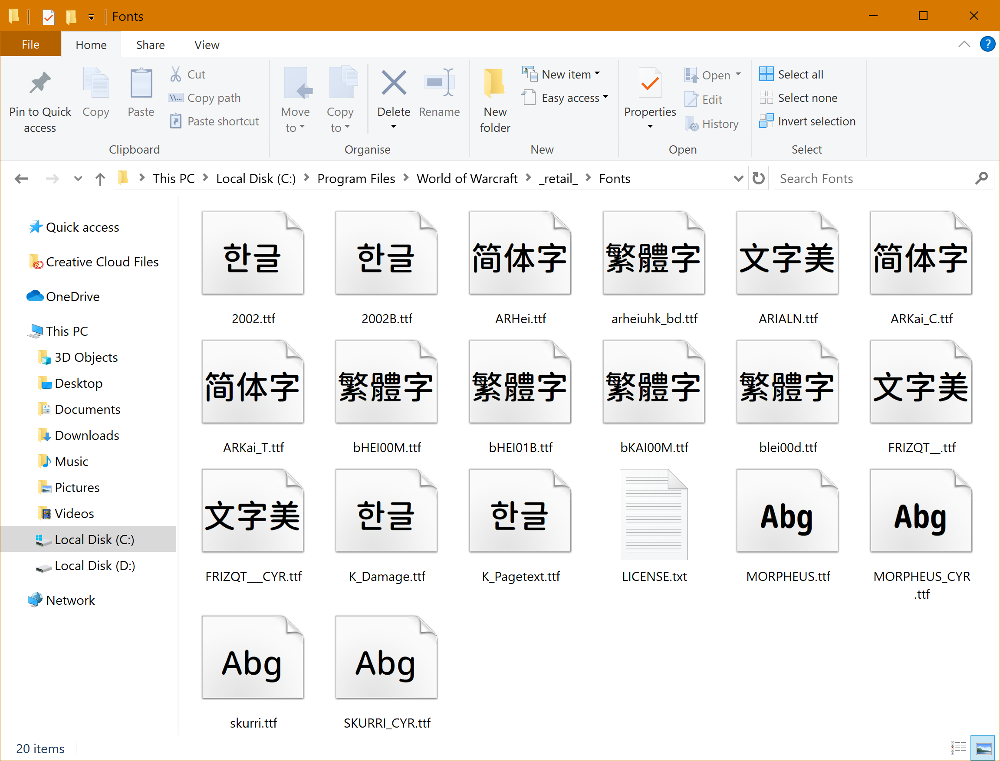

Languages: [English](README.md) [简体中文](README-Hans.md) [繁體中文](README-Hant.md) [日本語（部分翻訳）](README-ja.md)
 
Alternative Language: **Hànyǔ Pīnyīn**

*Zhùshì: zhè shì yī piān cèshì Kuòzhǎn Lādīng Zìfú de wéndàng.*

# Yǒu’ài Yuánjiǎo Zìtǐ

Yǒu’ài Yuánjiǎo Zìtǐ shì «Móshòu Shìjiè» zìtǐbāo, zhīchí suǒyǒu yǔyán. Yǒu’ài Yuánjiǎo Zìtǐ shì Noto Rounded hé [Resource Han Rounded](https://github.com/CyanoHao/Resource-Han-Rounded) de hébìng zìtǐ.

> Make Love, Not Warcraft. 
> 要有爱，不要魔兽争霸。 
> 要愛，不要魔獸。

## Xiàzài zhǐnán

[Zuìxīn de bǎnběn](https://github.com/CyanoHao/Nowar-Rounded/releases)

Yǒu’ài Yuánjiǎo Zìtǐ yǒu 4 zhǒng zìtǐ cūxì hé 6 zhǒng dìqū biànhuà de zìtǐ xíngtài.

### Zìtǐ cūxì

* L: xì
* R: chángguī
* M: zhōngděng
* B: cū
* [Morpheus (xīfāng yǔyán biāotí zìtǐ) cǎiyòngle gèng xì huòzhě gèng cū de zìtǐ cūxì, yònglái qiángdiào tūchū.]

### Dìqū biànhuà de zìtǐ xíngtài

Bù tóng de dìqū biànhuà de zìtǐ xíngtài cǎiyòng le bù tóng de zìtǐ xíngtài biāozhǔn.

|     | Xīfāng yǔyán                                            | Jiǎntǐ zhōngwén | Fántǐ zhōngwén | Hánguó yǔ    |
| --- | ------------------------------------------------------- | --------------- | -------------- | ------------ |
| CN  | Zhōngguó dàlù (UI xíngshì)                              | Zhōngguó dàlù   | Táiwān         | Chuántǒng de |
| TW  | Táiwān (UI xíngshì)                                     | Zhōngguó dàlù   | Táiwān         | Chuántǒng de |
| HK  | Xiānggǎng (UI xíngshì)                                  | Zhōngguó dàlù   | Xiānggǎng      | Chuántǒng de |
| JP  | Rìběn (UI xíngshì)                                      | Zhōngguó dàlù   | Táiwān         | Chuántǒng de |
| CL  | Chuántǒng de (UI xíngshì)                               | Chuántǒng de    | Chuántǒng de   | Chuántǒng de |
| OSF | Chuántǒng de (UI xíngshì, bù duìqí jīzhǔnxiàn de shùzì) | Chuántǒng de    | Chuántǒng de   | Chuántǒng de |

* Xīfāng yǔyán: Yīngyǔ, Xībānyá yǔ (Lādīng Měizhōu), Pútáoyá yǔ, Déyǔ, Xībānyá yǔ (Ōuzhōu), Fǎyǔ, Yìdàlì yǔ, Éyǔ.
* UI xíngshì: bèi zhōngwén hé xīfāng wénzì gòngyòng de biāodiǎn fúhào, dōu bèi dāngzuò xīfāng wénzì de biāodiǎn fúhào; zhōngwén de biāodiǎn fúhào shì bàn kuāndù de; Rìyǔ jiǎmíng de kuāndù shì chéngbǐlì de.

### SharedMedia zìtǐbāo

Yǒu’ài Yuánjiǎo Zìtǐ yě kěyǐ yǐ chājiàn de xíngshì ānzhuāng (FĒICHÁNG DE DÀ!), qǐyòng zhīhòu huì xiàng SharedMedia zhùcè Yǒu’ài Yuánjiǎo zìtǐ jiāzú.
